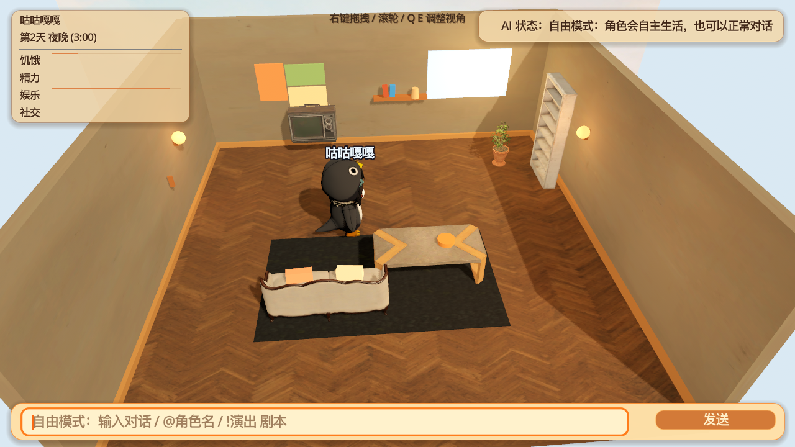
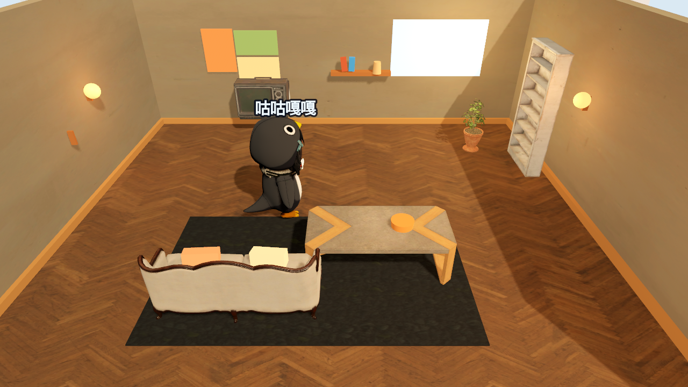
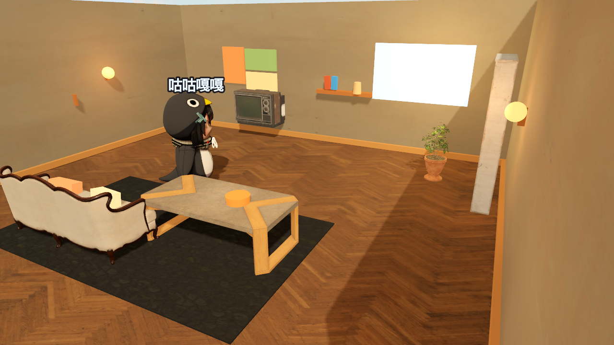
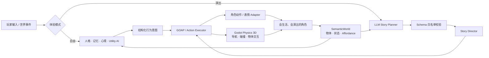

<div align="center">

# AI Living Town

### 让角色真正住进世界，而不是站在原地等待玩家按下 `E`

一个基于 Godot 4 的开源 AI 角色生活实验：角色拥有各自的记忆、人格、需要和行动，
既可以自由生活，也可以根据玩家输入的自然语言剧本共同演出。


</div>



> “咕咕嘎嘎发现盆栽缺水了，走过去浇水。忙完以后，她坐回沙发休息。”
>
> 这不只是一句写死的对白，而是一条由环境状态、角色动机、语义物体和动作执行器
> 共同完成的行为链。

## 这个项目想做什么？

我们想做一座会继续生活的小镇。

玩家可以导入自己的角色，写下人设，让他们拥有独立记忆、偏好与社交关系；
也可以输入一段小剧本，让 LLM 安排演员、走位、动作、表情、对白和场景交互。
未来，角色会知道杯子放在哪里、谁正在看电视、盆栽是否缺水，以及自己此刻更想
读书、休息，还是去找朋友聊两句。

当前原型先从一间温馨客厅开始。

## 两种体验模式

| 模式 | 会发生什么 |
|---|---|
| **自由模式** | 角色根据需要、心境、日程、记忆和环境状态自主行动；玩家可随时对任意角色说话 |
| **演出模式** | 玩家输入自然语言剧本，LLM 生成安全的结构化 Story，导演系统编排多角色走位、动作、表情、对白和物体交互 |

在输入框中可以试试：

```text
@咕咕嘎嘎 一起去看电视吗？

!演出 大家准备睡觉。卡提希娅关掉壁灯，相里要从书架取一本书，
遐蝶看看茶几上的奶茶，然后三个人互道晚安。

!自由
```

## 现在已经能做什么？

- 每个角色拥有隔离的记忆、人格、心境、动机和简化 Theory of Mind。
- 角色能感知 `SemanticWorld` 中的物体、状态、位置与可执行 Affordance。
- 自由生活行为支持环境触发、Utility 评分、玩家打断和任务恢复。
- 自然语言剧本可通过 OpenAI 兼容 LLM 动态转换为多角色演出。
- Story Schema 在本地执行白名单校验；LLM 不能直接操作 Godot 节点或运行代码。
- 动作、骨骼和表情通过角色 Adapter 解耦，可为不同模型配置映射。
- 书本与奶茶具有真实 `RigidBody3D`，支持拿起、放下和投掷。
- 地面、墙体、主要家具和角色已经接入 Godot Physics 3D。
- 支持 OpenAI 兼容聊天模型，以及可选的 ECNU TTS 分句异步语音。
- 没有 API Key 或本地测试角色资产时，项目仍可降级启动。

<table>
  <tr>
    <td width="50%">
      
      <p align="center"><b>自由生活：</b>角色在温馨客厅中感知环境并自主活动</p>
    </td>
    <td width="50%">
      
      <p align="center"><b>具身世界：</b>家具、灯光和小物体具有语义与物理状态</p>
    </td>
  </tr>
</table>

> README 截图仅使用公开检出能够呈现的场景与占位外观。开发者本机可以额外加载
> Git 忽略的适配验证资产，但这些第三方模型不会进入公开仓库。

## 五分钟运行

### 环境

- Godot `4.6.1`
- macOS / Linux / Windows
- 可选：OpenAI 兼容的聊天模型接口

### 启动

```bash
git clone https://github.com/Yangkailiang1/ai-companion-demo.git
cd ai-companion-demo
godot --editor project.godot
```

也可以直接运行：

```bash
godot --path .
```

未配置在线模型时，会使用有限的本地降级逻辑。若要启用 LLM 和语音：

```bash
cp data/llm_config.json.example data/llm_config.json
```

然后在本地的 `data/llm_config.json` 中填写服务地址、模型名和 API Key。
该文件已被 Git 忽略，请不要提交密钥。

## 它是怎么工作的？



核心原则是：**LLM 负责提出结构化意图，本地运行时负责安全地改变世界。**

## 项目结构

```text
ai_companion_demo/
├── scenes/                 # Godot 场景、角色与环境
├── scripts/
│   ├── core/               # 认知、记忆、语义世界、存档与公共协议
│   ├── characters/         # 角色控制、动作、表情与模型适配
│   ├── directing/          # 自由/演出模式、剧本规划与导演系统
│   ├── navigation/         # 导航和空间交互
│   ├── objects/            # 可交互物体与状态机
│   └── ui/                 # 对话与 HUD
├── cognition_lab/          # LangGraph 风格的角色认知实验
├── motion_lab/             # HumanML3D / Light-T2M 离线动作实验
├── data/                   # 人设、场景、动作、表情与 Story 配置
├── tools/                  # Blender、MMD 和资产处理工具
└── docs/                   # 架构、研究映射、验收与路线图
```

进一步阅读：

- [项目架构](docs/PROJECT_ARCHITECTURE.md)
- [自由模式与演出模式](docs/EXPERIENCE_MODES.md)
- [物理与场景交互](docs/PHYSICS_INTERACTIONS.md)
- [角色模型适配](docs/CHARACTER_ADAPTERS.md)
- [离线动作库](docs/OFFLINE_MOTION_LIBRARY.md)
- [长期开发规划树](docs/DEVELOPMENT_ROADMAP_TREE.md)
- [论文与研究索引](docs/KB-02-papers.md)

## 我们很需要这些开发者

如果你对下面任意方向感兴趣，欢迎加入：

- **Godot / Gameplay**：NavMesh 动态避障、手部 IK、物体占用与多人交互。
- **Agent / LLM**：长期记忆、社会关系、反思、日程规划和受约束即兴。
- **动画 / ML**：MMD/VRM/GLB 重定向、HumanML3D、Light-T2M 和动作检索。
- **3D 美术**：温馨住宅、小镇街道、模块化家具与统一卡通渲染。
- **UI / UX**：更像游戏、少像调试面板的对话和导演编辑体验。
- **测试 / 工程**：跨平台导出、性能剖析、自动化验收和插件化 Runtime。

开始贡献前请先阅读 [CLAUDE.md](CLAUDE.md) 中的工程规范。每项代码修改都应关联
稳定的路线图节点，并包含相应的失败路径或回归测试。

推荐贡献流程：

1. 创建 Issue，说明想解决的体验或路线图节点。
2. Fork 仓库并从 `master` 创建功能分支。
3. 保持模块边界，不让 LLM 直接修改世界状态。
4. 运行相关 Godot headless 验收。
5. 提交 Pull Request，并附上截图、录屏或测试结果。

## 快速验收

```bash
godot --headless --path . --script scripts/debug/headless_check.gd
godot --headless --path . --script scripts/debug/experience_modes_check.gd
godot --headless --path . --script scripts/debug/physics_interaction_check.gd
```

## 资产与许可边界

- Poly Haven 家具与 PBR 贴图按其公开的 CC0 条款记录。
- 许可证不明、仅限非商业或禁止再分发的角色模型只允许留在开发者本机，
  `assets/local_characters/` 已被 Git 忽略。
- HumanML3D、SMPL-X、MMD 和第三方预训练权重需要分别遵守其原始许可。
- 完整来源记录见 [ASSET_PROVENANCE.md](docs/ASSET_PROVENANCE.md)。

仓库目前仍是早期研究原型，尚未添加统一的代码 `LICENSE`。在项目所有者选定
正式开源许可证前，请不要假定仓库中的所有内容都具有相同的再使用权限。

---

<div align="center">

**我们不是在给 NPC 写更多台词，而是在尝试给他们一段可以继续发生的生活。**

</div>
